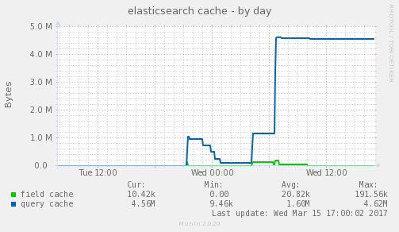
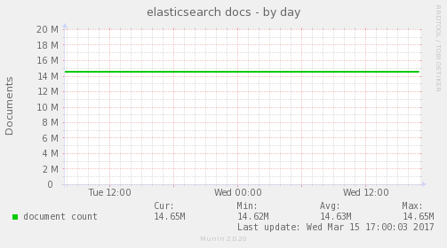
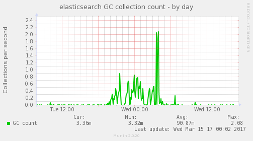
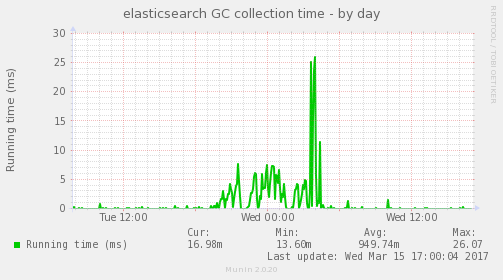
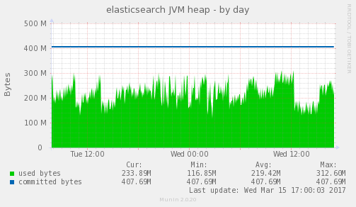
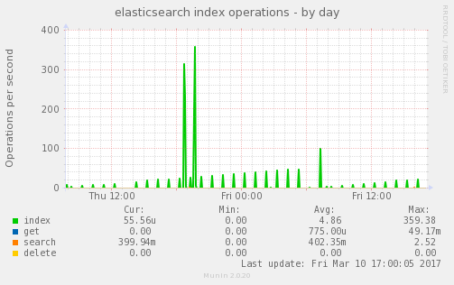
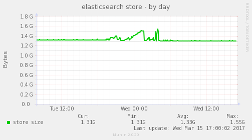

# Munin plugin for elasticsearch

A simple Munin plugin for monitoring elasticsearch nodes in Ruby. Depends on [JSON gem](http://rubygems.org/gems/json).

## Supported Modes

### Cache


`elasticsearch_cache` - field and query cache stats

### Docs


`elasticsearch_docs` - document count

### Garbage Collection


`elasticsearch_gc` - GC collections/sec

### Garbage Collection Running Time


`elasticsearch_gc_time` - GC collection running time in ms

### JVM Heap


`elasticsearch_jvm` - JVM heap stats

### Operations


`elasticsearch_ops` - index, get, search, delete operations/sec

### Store


`elasticsearch_store` - Size of index on disk

## Configuration

### Variables
 * host - a elasticsearch node capable of providing stats interface (default localhost)
 * port - elasticsearch HTTP API port (default 9200)
 * node - the name of the node to monitor (required)

### Example Config
```
[elasticsearch_*]
env.host 10.1.2.14
env.port 9200
env.node pinky rat
```

